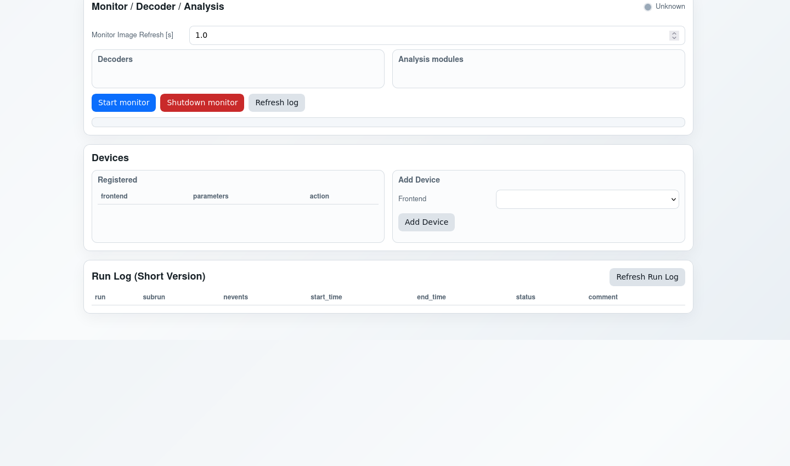
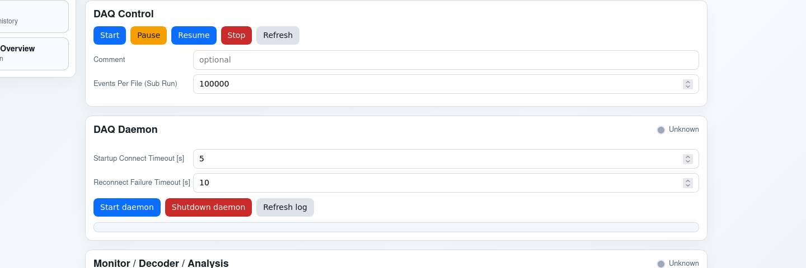
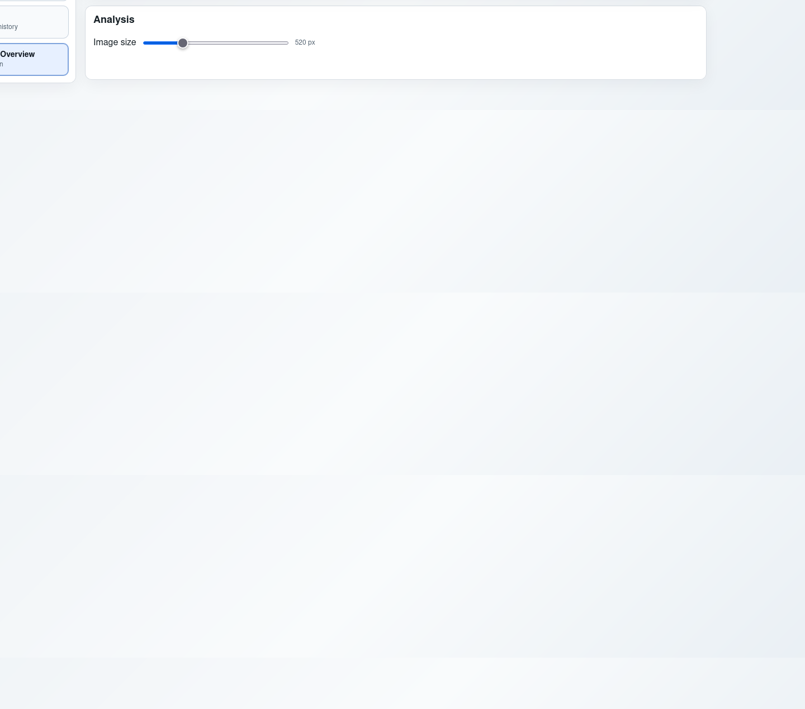
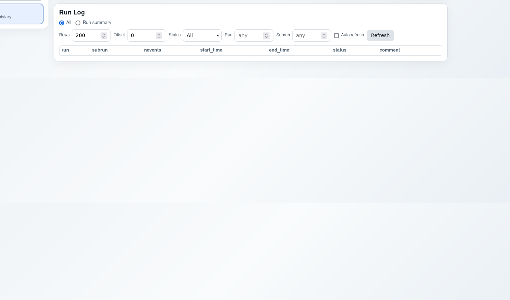

# SimpleDAQ

## Index
1. [Purpose](#1-purpose)
2. [Requirements](#2-requirements)
3. [Build and Environment](#3-build-and-environment)
4. [First End-to-End Run](#4-first-end-to-end-run)
5. [Web UI Operational Procedure](#5-web-ui-operational-procedure)
6. [CLI Operation](#6-cli-operation)
7. [Monitoring and Analysis](#7-monitoring-and-analysis)
8. [Configuration](#8-configuration)
9. [Troubleshooting](#9-troubleshooting)
10. [KC705 TOF Frame Definition](#10-kc705-tof-frame-definition)

## 1. Purpose
SimpleDAQ is built for practical online DAQ operation. The intended flow is straightforward: prepare input devices, bring the daemon online, start acquisition, monitor health and analysis outputs, and stop cleanly with run history left in a queryable log. The repository includes both the C++ runtime and the Python Web backend so that operators can work from one interface instead of stitching separate tools manually.

In daily use, most operators interact with the Web UI and only use command-line tools when they need automation or low-level debugging. For that reason, this README is written as an execution guide rather than an internal code map.

## 2. Requirements
You need a C++ build toolchain, ZeroMQ development headers, Python, and the Python dependencies used by the Web backend. If any of these is missing, startup failures often appear later as secondary errors, so it is worth validating prerequisites first.

The C++ side requires CMake 3.16 or newer, a C++17 compiler, `pkg-config`, and `libzmq` development packages. The Web backend requires Python 3.10+ with `pip`, plus the packages listed in `web/requirements.txt` (`fastapi`, `uvicorn`, `pyzmq`). If you rely on run-log features in the UI, the backend also expects the `mysql` command to be available because MySQL queries are executed via subprocess.

## 3. Build and Environment
From repository root, run a normal CMake configure/build. After compilation, add the build directory to `PATH` so executable names can be used directly in every example in this document.

```bash
cmake -S . -B build
cmake --build build -j
export PATH="$PWD/build:$PATH"
```

Verify command resolution before continuing:

```bash
command -v daqd daqctl daq_core datamon kc705_tof_dummy_device
```

Then prepare Python for the Web backend. If you already use your site bootstrap (`setup.sh`), you can keep that environment; otherwise create a local virtual environment and install the backend dependencies.

```bash
python3 -m venv .venv
source .venv/bin/activate
pip install -r web/requirements.txt
```

## 4. First End-to-End Run
This section is the minimum reproducible procedure to confirm the full chain works.

Start two dummy sources in separate terminals. One should emit board 0 on port 9101, and the other board 1 on port 9102. The dummy program now uses `--rate-hz`; `--interval-ms` is not a valid option in current code.

```bash
kc705_tof_dummy_device --board-id 0 --channel-min 0 --channel-max 15 --port 9101 --rate-hz 200
```

```bash
kc705_tof_dummy_device --board-id 1 --channel-min 0 --channel-max 15 --port 9102 --rate-hz 200
```

In another terminal, start the Web backend:

```bash
python3 -m web.server --host 0.0.0.0 --port 8080 --config web/defaults.json
```

Open `http://127.0.0.1:8080/` (or a forwarded port if you are remote). On the main page, first confirm that the Devices table contains the intended board entries. Then start the daemon from the DAQ Daemon panel, wait for healthy status, set comment and events-per-file in DAQ Control, and press Start. A successful run is indicated by `running` state, increasing counters, and advancing file progress.

When you are done, stop from DAQ Control first. After the run stops, confirm Run Log entries, then stop monitor and daemon if no further acquisition is planned.

## 5. Web UI Operational Procedure
This section is the UI operation procedure in the order operators actually use it. Follow the sequence top to bottom during a run.

### 5.1 Devices: define run topology first
Before starting anything else, confirm the Devices panel contains the exact board list you intend to acquire. The backend builds the DAQ start request from this table, so missing rows mean missing data, and wrong rows mean wrong run composition.

What to do:
- add one row per board,
- verify `board_id`, host, and port for each row,
- remove stale rows before pressing Start.


### 5.2 DAQ Daemon: bring control plane online
After device rows are correct, start the daemon from the DAQ Daemon panel. Do not start DAQ while daemon health is bad or unreachable.

What to do:
- click **Start daemon**,
- wait for healthy/reachable status,
- if it fails, use **Refresh log** and fix errors first.



### 5.3 DAQ Control: start and manage data taking
Once daemon health is good, move to DAQ Control. Set run metadata and rollover policy before starting.

What to do:
- enter a meaningful **Comment**,
- set **Events Per File**,
- click **Start**,
- confirm state becomes `running` and counters increase.

During run:
- **Pause** and **Resume** for temporary interruptions,
- **Stop** for clean run finalisation,
- **Refresh** if status looks stale.



### 5.4 Monitor panel: start online monitoring
If online feedback is required, start monitor after DAQ is running. Select decoder and analysis modules first, then launch monitor.

What to do:
- choose decoder/analysis,
- click **Start monitor**,
- verify monitor status is running,
- check monitor log if no analysis output appears.


### 5.5 Analysis page: inspect live behaviour
When monitor is active, open the analysis page from the sidebar. This page is for real-time operational judgement, not final offline analysis.

What to do:
- open module page from sidebar,
- use image size control for readability,
- inspect trends/histograms for obvious anomalies.



### 5.6 Run Log page: confirm run closure
After stopping DAQ, always validate run completion in Run Log. This is the final operational check before handover.

What to verify:
- run/subrun numbering continuity,
- event totals and timestamps,
- status/comment consistency.



## 6. CLI Operation
All UI actions have command-line equivalents through `daqd` and `daqctl`. This matters for scripting and for isolating UI-specific issues.

Start daemon:

```bash
daqd --endpoint ipc:///tmp/simpledaq_ctrl.sock --status-endpoint ipc:///tmp/simpledaq_status.sock --data-endpoint ipc:///tmp/simpledaq_data.sock
```

Check status:

```bash
daqctl --endpoint ipc:///tmp/simpledaq_ctrl.sock status
```

Start a run:

```bash
daqctl --endpoint ipc:///tmp/simpledaq_ctrl.sock start \
  --output-dir ./output \
  --events-per-file 100000 \
  --comment "commissioning" \
  --device kc705_tof=0@127.0.0.1:9101 \
  --device kc705_tof=1@127.0.0.1:9102
```

Stop and shutdown:

```bash
daqctl --endpoint ipc:///tmp/simpledaq_ctrl.sock stop
daqctl --endpoint ipc:///tmp/simpledaq_ctrl.sock shutdown
```

## 7. Monitoring and Analysis
`datamon` is the runtime used for decoding and online analysis views. In normal UI-based operation, the backend starts it for you, but direct invocation is useful for debugging.

To inspect available decoder/analysis modules:

```bash
datamon --list-modules --json
```

To decode an existing file:

```bash
datamon --input-file ./output/run00001_sub00000.dat --decoder kc705_tof --print-every 1000
```

To subscribe to the live data endpoint:

```bash
datamon --data-endpoint ipc:///tmp/simpledaq_data.sock --decoder kc705_tof --text-stream --no-console
```

If analysis pages in the UI are empty, verify that monitor is running, decoder/analysis selections are compatible, and events are actually flowing through the data endpoint.

## 8. Configuration
The primary Web runtime configuration is `web/defaults.json`. In practice, the most important fields are executable resolution (`bin_path`), log location (`log_path`), output location (`output_dir`), default devices (`devices`), and monitor defaults (`datamon_decoder`, `datamon_analyses`).

Environment variables can override these at launch time. The ones most frequently used in deployment are:
- `SIMPLEDAQ_WEB_CONFIG`
- `SIMPLEDAQ_DAQD`
- `SIMPLEDAQ_DAQCTL`
- `SIMPLEDAQ_DATAMON`
- `SIMPLEDAQ_CTRL_ENDPOINT`
- `SIMPLEDAQ_STATUS_ENDPOINT`
- `SIMPLEDAQ_DATA_ENDPOINT`
- `SIMPLEDAQ_MYSQL_HOST`
- `SIMPLEDAQ_MYSQL_PORT`
- `SIMPLEDAQ_MYSQL_USER`
- `SIMPLEDAQ_MYSQL_PASSWORD`
- `SIMPLEDAQ_MYSQL_DATABASE`
- `SIMPLEDAQ_MYSQL_TABLE`

## 9. Troubleshooting
When DAQ does not start, begin with the simplest checks in order: daemon health, device table correctness, and daemon logs. Most initial failures come from missing daemon startup, wrong device address/port, or path/environment mismatches.

When DAQ starts and quickly drops, check reconnect and timeout messages in daemon logs, then verify source processes are still alive and reachable. Do not assume run instability is a UI issue until endpoint and source health are confirmed.

When monitor runs but analysis is empty, confirm decoder and analysis compatibility, verify monitor logs for module errors, and confirm data traffic exists on the subscribed endpoint.

When run-log or next-run behaviour is broken, verify `mysql` command availability, credential overrides, and table schema initialisation.

## 10. KC705 TOF Frame Definition
Current KC705 TOF wire frame is fixed to 12 bytes: header `0xAA55`, 8-byte payload, footer `0x55AA`. Inside payload, the top 3 bits represent board ID, next 5 bits represent channel ID, and the remaining 56 bits represent raw timing value.

The decoder maps payload into `board_id`, `channel_id`, and `time`, where `time = raw_time * 4 ns`. The validator rejects header/footer mismatch and board ID mismatch before forwarding frames downstream.
